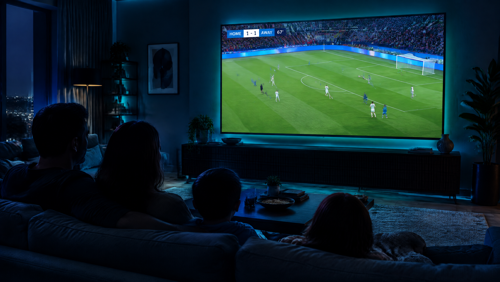
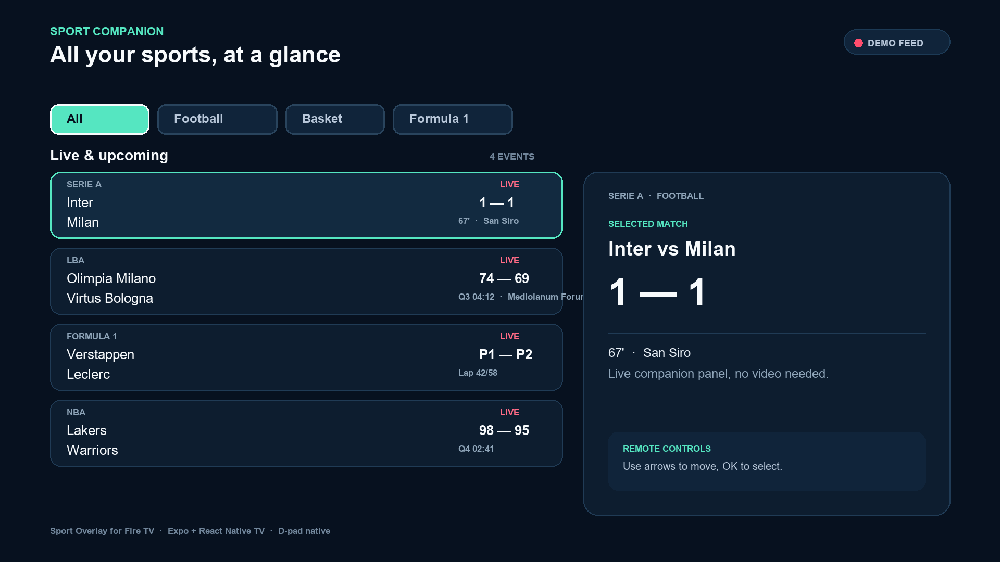
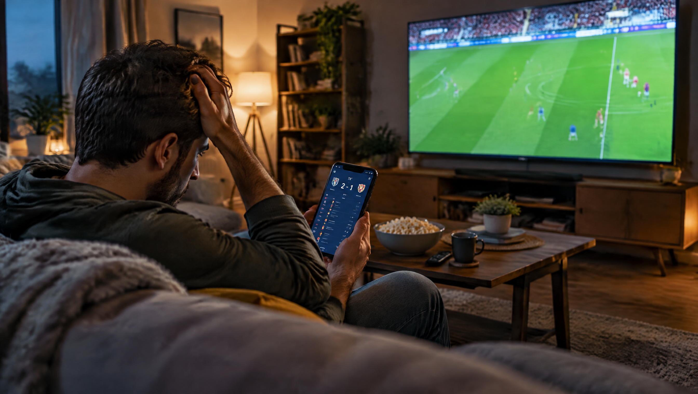
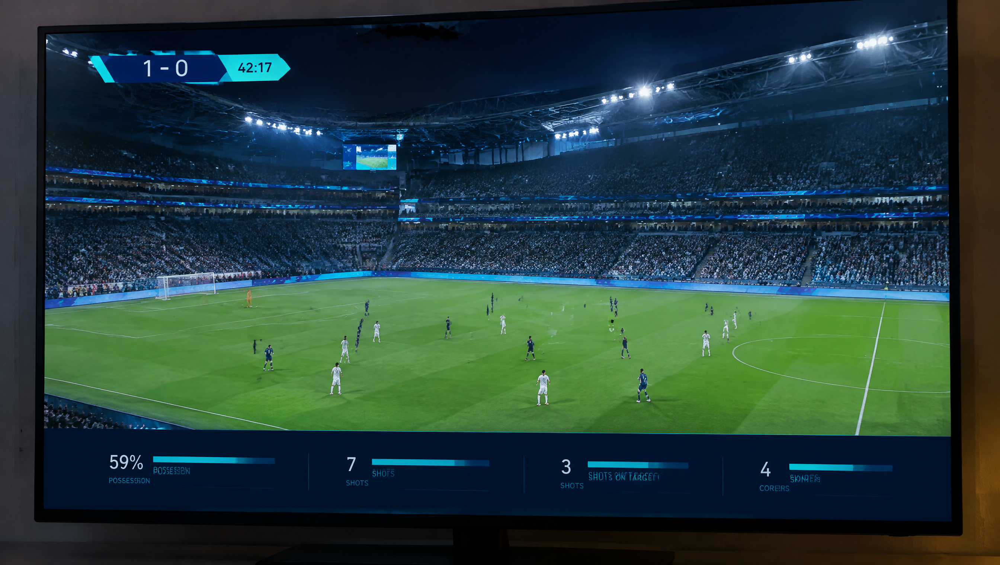
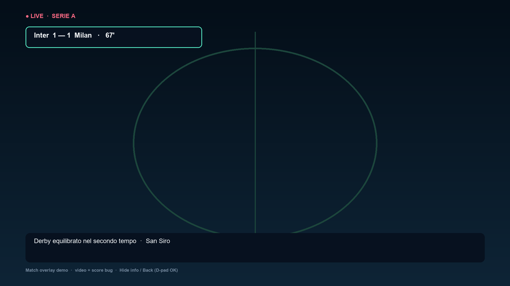
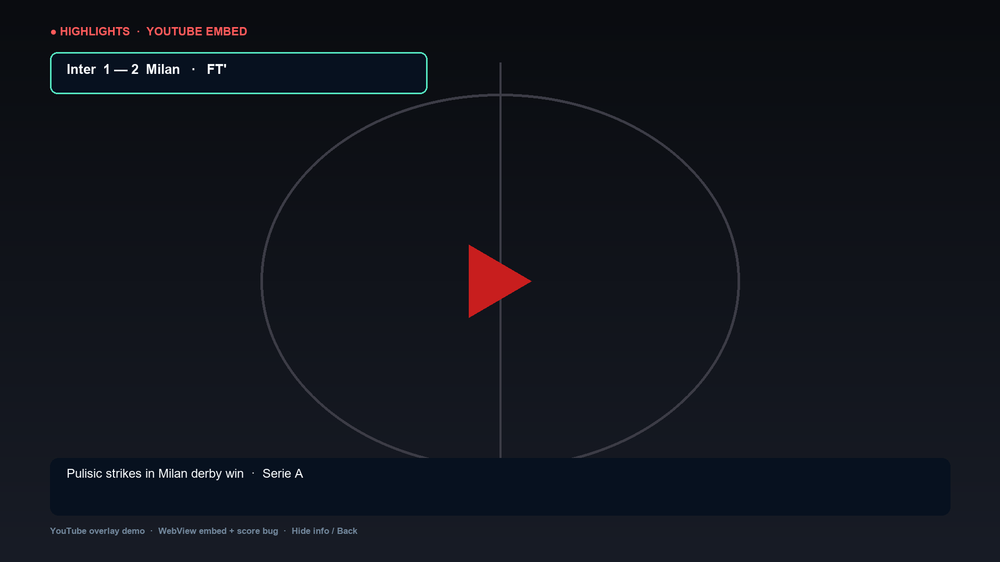
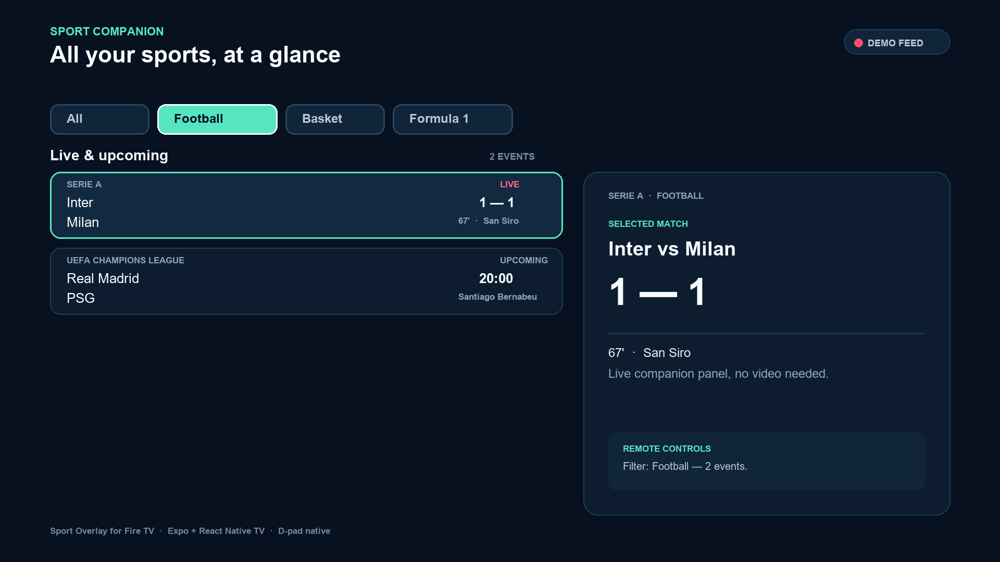
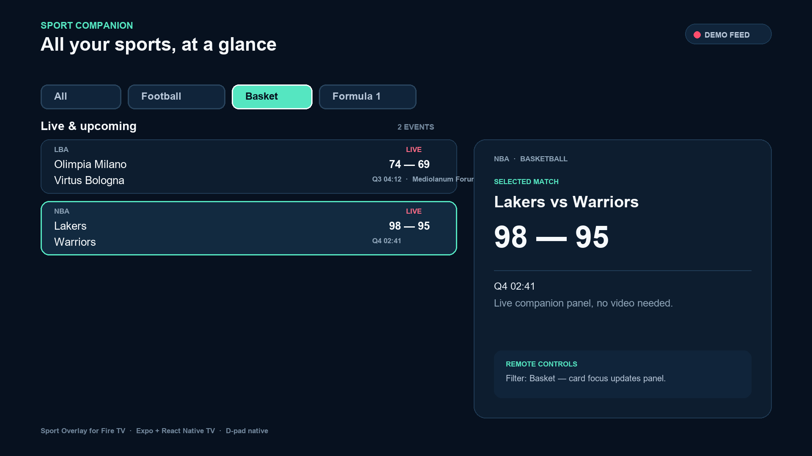
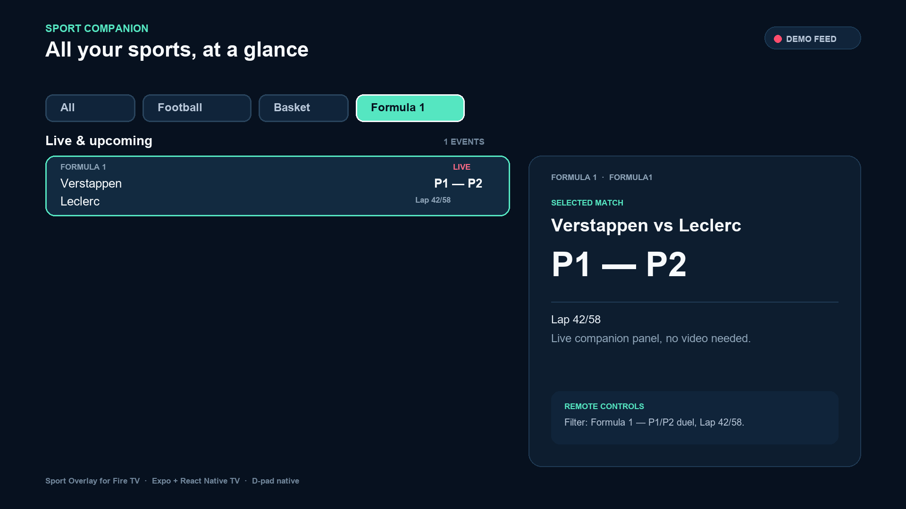
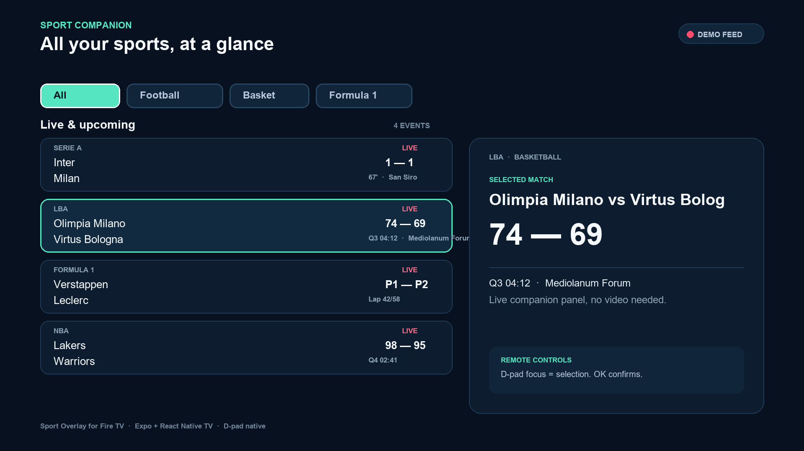

# Sport Overlay for Fire TV — Pitch Deck (10 slides, EN)

> Track: Fire TV (Sports — priority category) · Amazon Developer Hackathon 2026
> App: Expo + React Native TV · Landscape 10-foot UI · D-pad native · Demo feed, no backend needed

---

## Slide 1 — Title
**Sport Overlay for Fire TV**
*All your live sports, at a glance — on the biggest screen in the house.*

- Companion live multi-sport overlay: football, basketball, Formula 1
- Built for Fire OS / Vega OS with React Native TV
- Remote-first: arrows + OK, zero typing
- Repo: https://github.com/AliceMessi/amazon-sport-overlay


*AI-generated vision render (Higgsfield GPT Image 2.5).*



---

## Slide 2 — The Problem
**Live sports on TV are fragmented.**

- Scores live in phone apps, while the TV shows only one match at a time.
- Switching apps/channels to check other games breaks immersion.
- Existing TV guides are not designed for *live, multi-sport* glanceability.
- Result: fans miss key moments (goals, comebacks, overtakes).


*AI-generated concept render (Higgsfield GPT Image 2.5).*

---

## Slide 3 — Who Feels It
- **Casual fans / families:** want one calm screen showing "what's on now".
- **Multi-sport fans:** follow Serie A + NBA + F1 in the same evening.
- **Fire TV owners:** have a powerful living-room device, underused for live companion UX.
- Insight: the 10-foot experience must be readable from the couch and drivable with 5 buttons.

---

## Slide 4 — The Solution
**A calm, remote-driven sports companion for Fire TV.**

- One landscape screen: filters on top, event list left, detail panel right.
- Live badges, scores, period (67', Q3 04:12, Lap 42/58), venue, headline.
- Demo feed included — judges can run it with zero API keys.
- 100% offline-capable UI, TV-safe contrast and focus states.


*AI-generated concept render (Higgsfield GPT Image 2.5).*

## Slide 4b — NEW: Watch with Overlay (video + score bug)
**Yes — a match can play fullscreen with our info on top.**

- New `MatchOverlayScreen`: **YouTube derby highlights autoplay fullscreen** (WebView embed, no player chrome), score bug top-left, headline/venue bar bottom. mp4 fallback via `expo-video`.
- From any detail panel: **Watch with overlay** → video + overlay; `Hide info` / `Back` via D-pad OK.
- Change match video by swapping one ID (`YOUTUBE_DEMO_ID`).
- Tests: `matchOverlay.test.tsx` (YouTube default, embed URL, mp4 fallback, toggle, back). Suite now **6 files, 24 tests, green**.




---

## Slide 5 — How It Works (1/2): Filter → List
1. Pick a sport: **All / Football / Basket / Formula 1**.
2. List filters instantly; first visible match auto-selects.
3. Event counter shows scope ("4 EVENTS").




---

## Slide 6 — How It Works (2/2): Focus → Detail
- **D-pad focus = selection.** `onFocus` updates the right panel, `OK` confirms.
- Detail panel: competition, matchup, big score, period, venue, remote hint.
- Every control is `focusable` with visible selected state (`#55E6C1` border).




---

## Slide 7 — 10-Foot & D-pad UX
- Landscape-first, 48px margins, min 18sp text, high contrast (`#07111F` on `#F7FAFC`).
- Focus ring always visible; wrap-around navigation (`selectionMoved` reducer).
- No keyboard, no touch assumptions; Leanback launcher + 320×180 banner.
- Tested: `liveSportsScreen.test.tsx` — filter, focus-update, all-buttons-focusable.

---

## Slide 8 — Architecture
```
App.tsx → LiveSportsScreen → sportsDashboard reducer + filterMatches
src/domain/matches.ts   — Sport, SportMatch types
src/data/demoMatches.ts — 5 local events (Serie A, LBA, NBA, F1, UCL)
src/state/              — createDashboardState / dashboardReducer
plugins/withFireTv.js   — Leanback + banner config
```

- Stack: Expo 57, React 19, react-native-tvos, TypeScript strict.
- Quality gates: `npm run verify` = typecheck + eslint + jest → **19/19 green**.
- Fire TV exception rule satisfied: any framework OK if video shows device/simulator run.

---

## Slide 9 — Why This Fits the Track
- Fire TV priority category: **sports** — explicitly listed.
- Demo-ready: runs on Fire OS / Vega OS, also exports to web (`dist/`) for quick review.
- Friction-free judging: `npm install && npm test`, no secrets.
- Open Source mini-challenge eligible: MIT license, public repo, hackathon-window commits.

---

## Slide 10 — Roadmap & Ask
**Now:** demo feed, 3 sports, D-pad navigation.
**Next:** live WebSocket scores, Alexa+ "who's winning?" voice shortcut, favorites + reminders, team logos.
**Ask:** product feedback on Fire TV React Native tooling (prebuild, focus, Leanback) — full notes in submission.

- Try it: `npm install && npm run verify && npx expo start`
- Video (<3 min, EN): *to record on Fire TV / simulator*
- Team: solo, IT — CTO Hoken Tech. Feedback-driven, shipping for the living room.

---
*Screenshots in `docs/screenshots/` are faithful UI renders of `LiveSportsScreen` (same colors/layout/data as the app) for the deck and Devpost gallery until device captures land.*
